## 🌐 Socials:
  

# 💻 Tech Stack:
                  
# 📊 GitHub Stats:
 
 

### ✍️ Random Dev Quote

  ## 💰 You can help me by Donating
   

  
<!-- Proudly created with GPRM ( https://gprm.itsvg.in ) -->